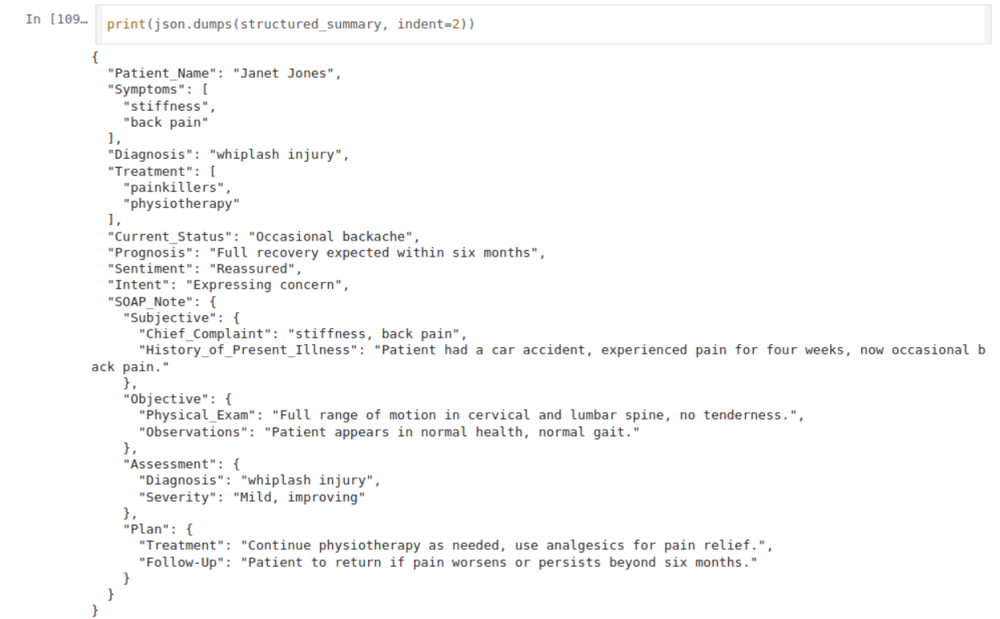

#  Physician-Notetaker 

Code Link: https://colab.research.google.com/github/princecorbett/Physician-Notetaker/blob/main/physician_Notemaker.ipynb

## Overview 

This project extracts medical information from patient transcripts using NLP techniques. It identifies symptoms, diagnoses, and treatments and generates structured SOAP notes. The pipeline utilizes spaCy for entity recognition and Hugging Face transformers for sentiment analysis, intent detection, and summarization.

### Sample output screenshot

##  Setup Instructions 

1. Clone the Repository

2. Create a Virtual Environment (Optional)

3. Install Dependencies

###  Ensure you have all necessary NLP models: 

4. Running the Application

 ### If using Google Colab: 

Open the provided Colab notebook.

Ensure dependencies are installed by running the first cell.

Upload or provide the medical transcript and execute the notebook.

### If running locally: 

This will process the sample transcript and output a structured summary in JSON format.

##  Usage 

Modify transcript in medical_nlp_pipeline.py to analyze different medical dialogues.

Update models or entity rules for improved accuracy.
